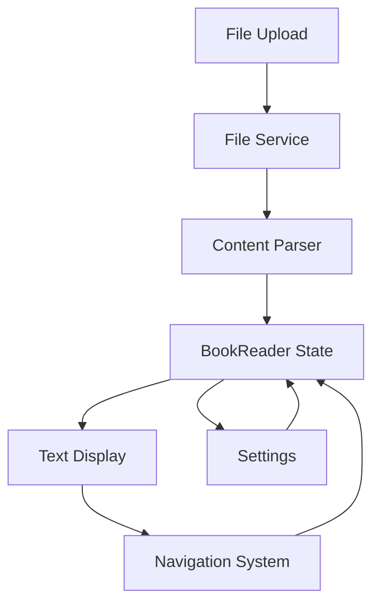
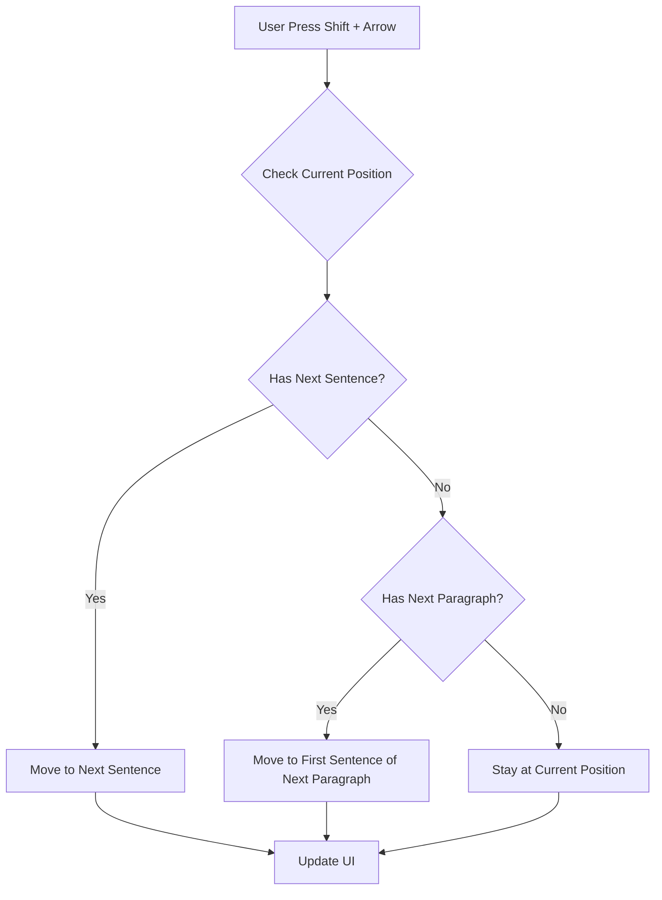
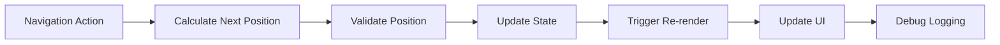

# Book Reader Application

## Technical Overview

### Core Architecture

#### 1. Component Hierarchy
```
BookReaderProvider
└── App
    └── BookReaderApp
        └── BookReader
            ├── TextDisplay
            │   └── TextHighlighter
            ├── SettingsOverlay
            └── Controls
```

#### 2. Data Flow


#### 3. State Management Architecture
```typescript
// Core state types
interface ApplicationState {
  content: DocumentContent;
  navigation: NavigationState;
  settings: UserSettings;
  system: SystemState;
}

interface NavigationState {
  currentPosition: Position;
  history: Position[];
  bookmarks: Bookmark[];
}

interface SystemState {
  isLoading: boolean;
  errors: ErrorState[];
  performance: PerformanceMetrics;
}
```

#### 1. Component Lifecycle Management
```typescript
// Component Lifecycle Manager
class ComponentLifecycleManager {
  private readonly lifecycleHooks: Map<string, LifecycleHook[]> = new Map();
  private readonly performanceMonitor: PerformanceMonitor;

  // Lifecycle hook registration
  registerHook(componentId: string, hook: LifecycleHook): void {
    const hooks = this.lifecycleHooks.get(componentId) || [];
    hooks.push(hook);
    this.lifecycleHooks.set(componentId, hooks);
  }

  // Lifecycle event handling
  async triggerLifecycleEvent(event: LifecycleEvent): Promise<void> {
    const span = this.performanceMonitor.startSpan(`lifecycle_${event.type}`);
    
    try {
      const hooks = this.lifecycleHooks.get(event.componentId) || [];
      await Promise.all(hooks.map(hook => hook.handle(event)));
    } finally {
      span.end();
    }
  }
}

// Custom hooks for component lifecycle management
function useComponentLifecycle(componentId: string) {
  const lifecycleManager = useContext(LifecycleContext);
  
  useEffect(() => {
    const hook: LifecycleHook = {
      handle: async (event) => {
        switch (event.type) {
          case 'mount':
            await handleMount(event);
            break;
          case 'update':
            await handleUpdate(event);
            break;
          case 'unmount':
            await handleUnmount(event);
            break;
        }
      }
    };

    lifecycleManager.registerHook(componentId, hook);
    return () => lifecycleManager.unregisterHook(componentId, hook);
  }, [componentId]);
}
```

#### 2. State Management Patterns
```typescript
// Advanced State Management System
class StateManager<T extends object> {
  private state: T;
  private readonly subscribers: Set<StateSubscriber<T>> = new Set();
  private readonly middleware: StateMiddleware<T>[] = [];
  private readonly validator: StateValidator<T>;

  constructor(initialState: T, validator: StateValidator<T>) {
    this.state = initialState;
    this.validator = validator;
  }

  // State update with validation and middleware
  async dispatch(action: StateAction<T>): Promise<void> {
    const prevState = this.state;
    let nextState = prevState;

    // Run middleware pipeline
    for (const middleware of this.middleware) {
      nextState = await middleware(nextState, action);
    }

    // Validate state changes
    if (!this.validator.validate(nextState)) {
      throw new StateValidationError(this.validator.getErrors());
    }

    // Update state and notify subscribers
    this.state = nextState;
    this.notifySubscribers(prevState, nextState);
  }

  // Optimized state updates for specific paths
  async updatePath<K extends keyof T>(
    path: K[],
    value: T[K],
    options: UpdateOptions = {}
  ): Promise<void> {
    const action: PathUpdateAction<T> = {
      type: 'PATH_UPDATE',
      path,
      value,
      options
    };
    await this.dispatch(action);
  }
}

// State synchronization with persistence
class StatePersistenceManager<T> {
  private readonly storage: Storage;
  private readonly serializer: StateSerializer<T>;
  private readonly compressionEnabled: boolean;

  async persist(state: T): Promise<void> {
    const serialized = this.serializer.serialize(state);
    const compressed = this.compressionEnabled
      ? await this.compress(serialized)
      : serialized;
    
    await this.storage.set('app_state', compressed);
  }

  async hydrate(): Promise<T | null> {
    const compressed = await this.storage.get('app_state');
    if (!compressed) return null;

    const serialized = this.compressionEnabled
      ? await this.decompress(compressed)
      : compressed;
    
    return this.serializer.deserialize(serialized);
  }
}
```

#### 3. Event Handling System
```typescript
// Event Bus Implementation
class EventBus {
  private readonly handlers: Map<string, Set<EventHandler>> = new Map();
  private readonly middleware: EventMiddleware[] = [];
  private readonly errorHandlers: Set<ErrorHandler> = new Set();

  // Event subscription with priority and filtering
  subscribe<T extends Event>(
    eventType: string,
    handler: EventHandler<T>,
    options: SubscriptionOptions = {}
  ): Subscription {
    const { priority = 0, filter } = options;
    const wrappedHandler: EventHandler<T> = async (event) => {
      if (filter && !filter(event)) return;
      
      try {
        await handler(event);
      } catch (error) {
        this.handleError(error, event);
      }
    };

    const handlers = this.getOrCreateHandlers(eventType);
    handlers.add({ handler: wrappedHandler, priority });
    this.sortHandlers(handlers);

    return {
      unsubscribe: () => handlers.delete(wrappedHandler)
    };
  }

  // Event emission with middleware processing
  async emit<T extends Event>(event: T): Promise<void> {
    const enrichedEvent = await this.processMiddleware(event);
    const handlers = this.handlers.get(event.type) || new Set();

    for (const { handler } of handlers) {
      try {
        await handler(enrichedEvent);
      } catch (error) {
        this.handleError(error, enrichedEvent);
      }
    }
  }
}

// React event handling integration
function useEventHandler<T extends Event>(
  eventType: string,
  handler: EventHandler<T>,
  deps: any[] = []
) {
  const eventBus = useContext(EventBusContext);

  useEffect(() => {
    const subscription = eventBus.subscribe(eventType, handler);
    return () => subscription.unsubscribe();
  }, deps);
}
```

#### 4. Performance Monitoring
```typescript
// Performance Monitoring System
class PerformanceMonitor {
  private readonly metrics: Map<string, Metric[]> = new Map();
  private readonly spans: Map<string, PerformanceSpan> = new Map();
  private readonly thresholds: Map<string, number> = new Map();

  // Performance measurement
  startSpan(name: string): PerformanceSpan {
    const span = new PerformanceSpan(name);
    this.spans.set(span.id, span);
    return span;
  }

  // Metric recording and analysis
  recordMetric(name: string, value: number): void {
    const metrics = this.getOrCreateMetrics(name);
    metrics.push({ timestamp: Date.now(), value });

    this.analyzeMetric(name, metrics);
  }

  // Performance analysis and alerting
  private analyzeMetric(name: string, metrics: Metric[]): void {
    const threshold = this.thresholds.get(name);
    if (!threshold) return;

    const average = this.calculateMovingAverage(metrics);
    if (average > threshold) {
      this.emitPerformanceAlert({
        type: 'THRESHOLD_EXCEEDED',
        metric: name,
        value: average,
        threshold
      });
    }
  }
}

// Component Performance Tracking
const withPerformanceTracking = <P extends object>(
  WrappedComponent: React.ComponentType<P>,
  options: TrackingOptions = {}
) => {
  return class PerformanceTrackedComponent extends React.Component<P> {
    private readonly performanceMonitor: PerformanceMonitor;
    private renderSpan: PerformanceSpan | null = null;

    componentDidMount() {
      this.trackMount();
    }

    componentDidUpdate() {
      this.trackUpdate();
    }

    render() {
      this.renderSpan = this.performanceMonitor.startSpan('render');
      const result = <WrappedComponent {...this.props} />;
      this.renderSpan.end();
      return result;
    }

    private trackMount(): void {
      const span = this.performanceMonitor.startSpan('mount');
      // Track mounting metrics
      span.end();
    }

    private trackUpdate(): void {
      const span = this.performanceMonitor.startSpan('update');
      // Track update metrics
      span.end();
    }
  };
};
```

### Implementation Details

#### 1. Text Processing Pipeline
```typescript
// 1. Document Loading
async function loadDocument(file: File): Promise<RawContent> {
  const buffer = await file.arrayBuffer();
  return parseDocument(buffer, file.type);
}

// 2. Content Parsing
interface ParsedContent {
  paragraphs: string[];
  metadata: DocumentMetadata;
  structure: DocumentStructure;
}

// 3. Text Analysis
interface TextAnalysis {
  sentences: SentenceInfo[];
  words: WordInfo[];
  readingTime: number;
}

// 4. Navigation Index
interface NavigationIndex {
  paragraphOffsets: number[];
  sentenceMap: Map<number, SentenceInfo>;
  wordIndices: Map<string, number[]>;
}
```

#### 2. Navigation System Architecture

```typescript
// Position Management
interface PositionManager {
  // Core position tracking
  getCurrentPosition(): Position;
  updatePosition(newPos: Position): void;
  validatePosition(pos: Position): boolean;

  // Navigation operations
  moveNext(unit: 'word' | 'sentence' | 'paragraph'): void;
  movePrevious(unit: 'word' | 'sentence' | 'paragraph'): void;
  jumpTo(position: Position): void;

  // Position calculations
  calculateNextPosition(unit: NavigationUnit): Position;
  calculatePreviousPosition(unit: NavigationUnit): Position;
  
  // Boundary checks
  isAtDocumentStart(): boolean;
  isAtDocumentEnd(): boolean;
  isAtParagraphBoundary(): boolean;
}

// Navigation State Management
class NavigationStateManager {
  private position: Position;
  private history: Position[] = [];
  private bookmarks: Map<string, Position> = new Map();

  constructor(private content: ParsedContent) {
    this.position = this.initializePosition();
  }

  private initializePosition(): Position {
    return {
      paragraphIndex: 0,
      sentenceIndex: 0,
      wordIndex: 0,
      offset: 0
    };
  }

  // Position validation with detailed checks
  private validatePosition(pos: Position): boolean {
    if (!this.content) return false;

    const paragraph = this.content.paragraphs[pos.paragraphIndex];
    if (!paragraph) return false;

    const sentences = this.getSentences(paragraph);
    if (pos.sentenceIndex >= sentences.length) return false;

    const words = this.getWords(sentences[pos.sentenceIndex]);
    return pos.wordIndex < words.length;
  }
}
```

#### 3. Performance Optimizations

```typescript
// 1. Text Content Caching
interface ContentCache {
  paragraphs: Map<number, ProcessedParagraph>;
  sentences: Map<string, ProcessedSentence[]>;
  words: Map<string, ProcessedWord[]>;
}

// 2. Memoized Text Processing
const memoizedSplitSentences = memoize((text: string): string[] => {
  // Complex sentence splitting logic
  return sentences;
}, {
  maxSize: 1000,
  onCacheHit: (key: string) => {
    metrics.cachePerfomance.hits++;
  }
});

// 3. Virtual Rendering
interface VirtualizationConfig {
  viewportHeight: number;
  itemHeight: number;
  overscanCount: number;
  totalItems: number;
}

const useVirtualization = (config: VirtualizationConfig) => {
  const getVisibleRange = useCallback(() => {
    const start = Math.floor(scrollTop / config.itemHeight);
    const end = Math.min(
      Math.ceil((scrollTop + config.viewportHeight) / config.itemHeight),
      config.totalItems
    );
    return { start, end };
  }, [config, scrollTop]);
};
```

#### 4. Error Handling and Recovery

```typescript
// 1. Error Boundary Implementation
class NavigationErrorBoundary extends React.Component<Props, State> {
  static getDerivedStateFromError(error: Error) {
    return { hasError: true, error };
  }

  componentDidCatch(error: Error, errorInfo: React.ErrorInfo) {
    logNavigationError(error, errorInfo);
    this.attemptRecovery();
  }

  private attemptRecovery() {
    const { position } = this.props;
    const recoveryPosition = this.calculateSafePosition(position);
    this.props.onPositionChange(recoveryPosition);
  }
}

// 2. Error Recovery Strategies
interface RecoveryStrategy {
  condition: (error: Error) => boolean;
  action: (state: ApplicationState) => Promise<ApplicationState>;
  fallback: () => void;
}

const navigationRecoveryStrategies: RecoveryStrategy[] = [
  {
    condition: (error) => error instanceof InvalidPositionError,
    action: async (state) => {
      const safePosition = await findNearestValidPosition(state.position);
      return { ...state, position: safePosition };
    }
  },
  // More strategies...
];
```

#### 5. Text Rendering System

```typescript
// 1. Rendering Pipeline
interface RenderingPipeline {
  // Pre-processing phase
  prepareContent(): ProcessedContent;
  calculateLayout(): LayoutMetrics;
  optimizeForViewport(): ViewportOptimizations;

  // Rendering phase
  renderParagraphs(): React.ReactNode[];
  renderHighlights(): React.ReactNode[];
  renderSelections(): React.ReactNode[];

  // Post-processing phase
  applyAnimations(): void;
  cleanupResources(): void;
}

// 2. Text Layout Engine
interface LayoutEngine {
  // Layout calculations
  calculateLineBreaks(text: string, width: number): LineBreak[];
  measureText(text: string): TextMetrics;
  optimizeLineHeight(fontSize: number): number;

  // Position calculations
  getCharacterPosition(index: number): Point;
  getWordBoundingBox(word: string): BoundingBox;
  getSentenceBoundingBox(sentence: string): BoundingBox;
}

// 3. Highlight Management
class HighlightManager {
  private highlights: Map<string, Highlight> = new Map();
  private layers: HighlightLayer[] = [];

  addHighlight(range: Range, style: HighlightStyle): string {
    const id = generateUniqueId();
    const rects = this.calculateHighlightRects(range);
    const highlight = { id, rects, style };
    this.highlights.set(id, highlight);
    return id;
  }

  private calculateHighlightRects(range: Range): DOMRect[] {
    return Array.from(range.getClientRects())
      .map(rect => this.adjustRectForScale(rect));
  }
}

// 4. Animation System
interface AnimationController {
  // Scroll animations
  scrollToPosition(position: Position): Promise<void>;
  smoothScrollToElement(element: HTMLElement): Promise<void>;

  // Highlight animations
  animateHighlight(id: string, style: AnimationStyle): Promise<void>;
  fadeOutHighlight(id: string): Promise<void>;

  // Text animations
  animateTextChange(element: HTMLElement, newText: string): Promise<void>;
  animateFont(element: HTMLElement, newFont: FontProperties): Promise<void>;
}
```

#### 6. Event Handling System

```typescript
// 1. Event Manager
class EventManager {
  private handlers: Map<EventType, Set<EventHandler>> = new Map();
  private eventQueue: PriorityQueue<Event> = new PriorityQueue();

  // Event registration
  registerHandler(type: EventType, handler: EventHandler, priority: number = 0) {
    if (!this.handlers.has(type)) {
      this.handlers.set(type, new Set());
    }
    this.handlers.get(type)?.add(handler);
  }

  // Event processing
  async processEvent(event: Event): Promise<void> {
    const handlers = this.handlers.get(event.type) || new Set();
    for (const handler of handlers) {
      try {
        await handler(event);
        if (event.isPropagationStopped()) break;
      } catch (error) {
        this.handleEventError(error, event);
      }
    }
  }
}

// 2. Keyboard Navigation Controller
class KeyboardNavigationController {
  private keyMap: Map<string, NavigationAction> = new Map();
  private commandHistory: CircularBuffer<Command> = new CircularBuffer(100);

  constructor() {
    this.initializeKeyMap();
    this.setupEventListeners();
  }

  private initializeKeyMap() {
    this.keyMap.set('ArrowRight', { type: 'MOVE_NEXT', unit: 'word' });
    this.keyMap.set('Shift+ArrowRight', { type: 'MOVE_NEXT', unit: 'sentence' });
    this.keyMap.set('Ctrl+ArrowRight', { type: 'MOVE_NEXT', unit: 'paragraph' });
    // ... more key mappings
  }

  private handleKeyPress(event: KeyboardEvent) {
    const key = this.getKeyCombo(event);
    const action = this.keyMap.get(key);
    if (action) {
      event.preventDefault();
      this.executeAction(action);
    }
  }
}

// 3. Touch/Gesture Handler
class GestureHandler {
  private touchStart: Point | null = null;
  private gestureTimeout: number | null = null;

  handleTouchStart(event: TouchEvent) {
    this.touchStart = {
      x: event.touches[0].clientX,
      y: event.touches[0].clientY
    };
    this.startGestureTimeout();
  }

  handleTouchMove(event: TouchEvent) {
    if (!this.touchStart) return;

    const currentPoint = {
      x: event.touches[0].clientX,
      y: event.touches[0].clientY
    };

    const delta = {
      x: currentPoint.x - this.touchStart.x,
      y: currentPoint.y - this.touchStart.y
    };

    this.processGesture(delta);
  }

  private processGesture(delta: Point) {
    // Implement gesture recognition logic
    if (Math.abs(delta.x) > Math.abs(delta.y)) {
      // Horizontal swipe
      if (delta.x > 50) this.emit('swipeRight');
      else if (delta.x < -50) this.emit('swipeLeft');
    } else {
      // Vertical swipe
      if (delta.y > 50) this.emit('swipeDown');
      else if (delta.y < -50) this.emit('swipeUp');
    }
  }
}

// 4. Selection Manager
class SelectionManager {
  private selection: Selection | null = null;
  private selectionStart: Position | null = null;
  private selectionEnd: Position | null = null;

  handleSelectionChange(event: Event) {
    const selection = window.getSelection();
    if (!selection) return;

    const range = selection.getRangeAt(0);
    this.updateSelection(range);
  }

  private updateSelection(range: Range) {
    const startPosition = this.getPositionFromNode(range.startContainer);
    const endPosition = this.getPositionFromNode(range.endContainer);

    this.selectionStart = startPosition;
    this.selectionEnd = endPosition;

    this.emit('selectionChange', {
      start: startPosition,
      end: endPosition,
      text: range.toString()
    });
  }

  private getPositionFromNode(node: Node): Position {
    // Implement position calculation logic
    return {
      paragraphIndex: this.findParagraphIndex(node),
      sentenceIndex: this.findSentenceIndex(node),
      wordIndex: this.findWordIndex(node),
      offset: this.calculateOffset(node)
    };
  }
}
```

#### 7. File Processing and Content Management

```typescript
// 1. File Processing Pipeline
interface FileProcessor {
  // File type detection and validation
  detectFileType(file: File): FileType;
  validateFile(file: File): ValidationResult;
  
  // Content extraction
  extractContent(file: File): Promise<RawContent>;
  extractMetadata(file: File): Promise<DocumentMetadata>;
  
  // Format-specific processors
  processPDF(file: File): Promise<ProcessedContent>;
  processEPUB(file: File): Promise<ProcessedContent>;
  processText(file: File): Promise<ProcessedContent>;
}

// 2. Content Processing System
class ContentProcessor {
  private processors: Map<FileType, ContentTypeProcessor> = new Map();
  private cache: ContentCache = new ContentCache();

  async processFile(file: File): Promise<ProcessedContent> {
    const fileType = this.detectFileType(file);
    const processor = this.processors.get(fileType);
    
    if (!processor) {
      throw new UnsupportedFileTypeError(fileType);
    }

    try {
      const rawContent = await processor.extractContent(file);
      const processedContent = await this.processContent(rawContent);
      this.cache.store(file.name, processedContent);
      return processedContent;
    } catch (error) {
      this.handleProcessingError(error, file);
      throw error;
    }
  }

  private async processContent(raw: RawContent): Promise<ProcessedContent> {
    return {
      text: await this.processText(raw.text),
      structure: await this.analyzeStructure(raw.text),
      metadata: raw.metadata,
      statistics: this.generateStatistics(raw.text)
    };
  }
}

// 3. PDF Processing
class PDFProcessor implements ContentTypeProcessor {
  private pdfjs: any; // PDF.js instance

  async extractContent(file: File): Promise<RawContent> {
    const data = await file.arrayBuffer();
    const pdf = await this.pdfjs.getDocument(data).promise;
    
    const pages = await this.extractPages(pdf);
    const text = this.processPages(pages);
    const metadata = await pdf.getMetadata();

    return {
      text,
      metadata,
      structure: this.detectStructure(pages)
    };
  }

  private async extractPages(pdf: any): Promise<PDFPageContent[]> {
    const pagePromises = [];
    for (let i = 1; i <= pdf.numPages; i++) {
      pagePromises.push(this.extractPageContent(pdf, i));
    }
    return Promise.all(pagePromises);
  }

  private processPages(pages: PDFPageContent[]): string {
    return pages
      .map(page => this.processPageContent(page))
      .join('\n\n');
  }

  private processPageContent(page: PDFPageContent): string {
    // Group text items by their y-coordinate to form lines
    const lineMap = new Map<number, string[]>();
    
    page.items.forEach(item => {
      const y = Math.round(item.transform[5]);
      if (!lineMap.has(y)) {
        lineMap.set(y, []);
      }
      lineMap.get(y)?.push(item.str);
    });

    // Sort lines by y-coordinate (top to bottom)
    const sortedYCoords = Array.from(lineMap.keys()).sort((a, b) => b - a);
    
    // Join lines into paragraphs
    return this.formParagraphs(sortedYCoords.map(y => lineMap.get(y)?.join(' ')));
  }

  private formParagraphs(lines: string[]): string {
    const paragraphs: string[] = [];
    let currentParagraph: string[] = [];

    lines.forEach(line => {
      if (this.isNewParagraph(line, currentParagraph)) {
        if (currentParagraph.length > 0) {
          paragraphs.push(currentParagraph.join(' '));
          currentParagraph = [];
        }
      }
      currentParagraph.push(line);
    });

    if (currentParagraph.length > 0) {
      paragraphs.push(currentParagraph.join(' '));
    }

    return paragraphs.join('\n\n');
  }
}

// 4. Content Cache System
class ContentCache {
  private cache: Map<string, CacheEntry> = new Map();
  private maxSize: number = 100 * 1024 * 1024; // 100MB
  private currentSize: number = 0;

  store(key: string, content: ProcessedContent): void {
    const size = this.calculateSize(content);
    
    // Ensure there's enough space
    while (this.currentSize + size > this.maxSize) {
      this.evictOldest();
    }

    this.cache.set(key, {
      content,
      size,
      timestamp: Date.now(),
      accessCount: 0
    });
    this.currentSize += size;
  }

  retrieve(key: string): ProcessedContent | null {
    const entry = this.cache.get(key);
    if (entry) {
      entry.accessCount++;
      entry.timestamp = Date.now();
      return entry.content;
    }
    return null;
  }

  private evictOldest(): void {
    let oldest: [string, CacheEntry] | null = null;
    
    for (const [key, entry] of this.cache.entries()) {
      if (!oldest || entry.timestamp < oldest[1].timestamp) {
        oldest = [key, entry];
      }
    }

    if (oldest) {
      this.cache.delete(oldest[0]);
      this.currentSize -= oldest[1].size;
    }
  }

  private calculateSize(content: ProcessedContent): number {
    // Implement size calculation logic
    return JSON.stringify(content).length;
  }
}

// 5. Content Analysis System
class ContentAnalyzer {
  analyzeDocument(content: ProcessedContent): DocumentAnalysis {
    return {
      readability: this.calculateReadability(content.text),
      structure: this.analyzeStructure(content),
      statistics: this.calculateStatistics(content),
      language: this.detectLanguage(content.text)
    };
  }

  private calculateReadability(text: string): ReadabilityMetrics {
    return {
      fleschKincaid: this.calculateFleschKincaid(text),
      automatedReadability: this.calculateARI(text),
      colemanLiau: this.calculateColemanLiau(text)
    };
  }

  private analyzeStructure(content: ProcessedContent): DocumentStructure {
    return {
      paragraphs: this.analyzeParagraphs(content.text),
      headings: this.detectHeadings(content),
      lists: this.detectLists(content),
      tables: this.detectTables(content)
    };
  }

  private calculateStatistics(content: ProcessedContent): DocumentStatistics {
    return {
      wordCount: this.countWords(content.text),
      sentenceCount: this.countSentences(content.text),
      paragraphCount: this.countParagraphs(content),
      averageWordLength: this.calculateAverageWordLength(content.text),
      averageSentenceLength: this.calculateAverageSentenceLength(content.text)
    };
  }
}
```

## Project Overview

The Book Reader application is a web-based document reader that supports multiple file formats (PDF, EPUB, and plain text) with features for precise navigation, text highlighting, and customizable reading preferences. It's built with accessibility and user experience in mind, offering keyboard navigation, auto-scrolling, and various visual customization options.

## Project Structure

```
book-reader/
├── src/
│   ├── components/         # React components
│   │   ├── BookReader.tsx  # Main reader component
│   │   ├── TextDisplay.tsx # Text rendering and navigation
│   │   └── ...
│   ├── context/           # React context providers
│   │   └── BookReaderContext.tsx
│   ├── hooks/             # Custom React hooks
│   │   ├── useTextNavigation.ts
│   │   └── ...
│   ├── services/          # Core services
│   │   └── fileService.ts
│   └── types/             # TypeScript type definitions
└── ...
```

## Core Features

### 1. File Format Support
- PDF parsing with preserved paragraph structure
- EPUB support with metadata extraction
- Plain text file support
- Intelligent paragraph and sentence detection

### 2. Navigation System
The application implements a sophisticated navigation system that allows users to move through text at different granularity levels:

#### Text Navigation Levels
- Word-by-word navigation
- Sentence-by-sentence navigation
- Paragraph-by-paragraph navigation
- Page-by-page navigation

#### Keyboard Shortcuts
- Left/Right Arrow: Page navigation
- Alt + Left/Right: Word navigation
- Shift + Left/Right: Sentence navigation
- Ctrl + Left/Right: Paragraph navigation
- Space: Toggle play/pause for auto-scrolling

### 3. Reading Preferences
Customizable reading preferences stored in local storage:

```typescript
interface UserPreferences {
  autoScrollSpeed: number;     // Words per minute
  fontSize: number;           // Base font size
  lineSpacing: string;       // Line height
  paragraphBackground: string;
  sentenceHighlight: string;
  wordHighlight: string;
  fontFamily: string;
  textAlign: string;
  theme: string;
  pageWidth: number;
}
```

## Technical Implementation

### 1. Application Architecture

#### Component Structure
```
src/
├── components/
│   ├── BookReader.tsx       # Main container component
│   ├── TextDisplay.tsx      # Text rendering and navigation
│   ├── SettingsOverlay.tsx # User preferences UI
│   └── Settings.tsx        # Settings management
├── context/
│   └── BookReaderContext.tsx # Global state management
├── hooks/
│   ├── useTextNavigation.ts # Navigation logic
│   └── useTTS.ts           # Text-to-speech functionality
├── services/
│   └── fileService.ts      # File parsing and processing
└── types/
    └── index.ts            # TypeScript type definitions
```

#### Key Components

1. **BookReader.tsx**
```typescript
interface BookReaderProps {
  file: File;
}

const BookReader: React.FC<BookReaderProps> = ({ file }) => {
  // Handles file loading, keyboard navigation, and UI state
  const { state, dispatch } = useBookReader();
  const {
    position,
    moveToNextWord,
    movePreviousWord,
    // ... other navigation functions
  } = useTextNavigation({
    text: state.content?.text || '',
    autoScrollSpeed: state.preferences.autoScrollSpeed,
    isPlaying: state.isPlaying,
    onPositionChange: handlePositionChange,
  });
};
```

2. **TextDisplay.tsx**
```typescript
interface TextDisplayProps {
  text: string;
  currentPosition: ReadingPosition;
  moveToNextWord: () => void;
  movePreviousWord: () => void;
  moveToNextSentence: () => void;
  movePreviousSentence: () => void;
  moveToNextParagraph: () => void;
  movePreviousParagraph: () => void;
}
```

### 2. State Management

#### Global State Structure
```typescript
interface BookReaderState {
  content: BookContent | null;
  preferences: UserPreferences;
  progress: {
    position: ReadingPosition;
    timestamp: number;
    bookId: string;
  } | null;
  isPlaying: boolean;
  isSpeaking: boolean;
}

interface UserPreferences {
  autoScrollSpeed: number;     // Words per minute
  fontSize: number;           // Base font size
  lineSpacing: string;       // Line height
  paragraphBackground: string;
  sentenceHighlight: string;
  wordHighlight: string;
  fontFamily: string;
  textAlign: string;
  theme: string;
  pageWidth: number;
}
```

#### Context Implementation
```typescript
const BookReaderContext = createContext<{
  state: BookReaderState;
  dispatch: React.Dispatch<Action>;
} | null>(null);

type Action =
  | { type: 'SET_CONTENT'; payload: BookContent }
  | { type: 'UPDATE_PREFERENCES'; payload: Partial<UserPreferences> }
  | { type: 'UPDATE_POSITION'; payload: ReadingPosition }
  | { type: 'TOGGLE_PLAY' }
  | { type: 'TOGGLE_SPEAK' };
```

### 3. Navigation System

#### Position Tracking
```typescript
interface ReadingPosition {
  paragraphIndex: number;
  sentenceIndex: number;
  wordIndex: number;
}
```

#### Navigation Hook Implementation
```typescript
export function useTextNavigation({
  text,
  autoScrollSpeed,
  isPlaying,
  onPositionChange,
}: UseTextNavigationProps) {
  const [position, setPosition] = useState<ReadingPosition>({
    paragraphIndex: 0,
    sentenceIndex: 0,
    wordIndex: 0,
  });

  // Navigation functions
  const moveToNextSentence = useCallback(() => {
    const currentSentences = getCurrentSentences();
    const currentSentenceIndex = position.sentenceIndex;

    if (currentSentenceIndex + 1 < currentSentences.length) {
      setPosition(prev => ({
        ...prev,
        sentenceIndex: currentSentenceIndex + 1,
        wordIndex: 0
      }));
    } else if (position.paragraphIndex + 1 < paragraphs.length) {
      // Move to next paragraph
    }
  }, [getCurrentSentences, position, paragraphs.length]);

  // Similar implementations for other navigation functions
}
```

### 4. Text Processing

#### 4.1 Text Analysis Engine
```typescript
class TextAnalysisEngine {
  // Core text analysis pipeline
  async analyzeText(text: string): Promise<TextAnalysis> {
    const language = await this.detectLanguage(text);
    const sentences = this.analyzeSentences(text, language);
    const words = this.analyzeWords(text, language);
    const readability = this.calculateReadability(sentences, words);
    
    return {
      language,
      sentences,
      words,
      readability,
      statistics: this.generateStatistics(sentences, words)
    };
  }

  // Advanced sentence detection with machine learning
  private analyzeSentences(text: string, language: string): SentenceAnalysis[] {
    return this.sentenceDetector.analyze(text, {
      language,
      features: {
        boundaries: true,
        sentiment: true,
        complexity: true,
        grammar: true
      }
    });
  }

  // Word analysis with linguistic features
  private analyzeWords(text: string, language: string): WordAnalysis[] {
    return this.wordAnalyzer.analyze(text, {
      language,
      features: {
        pos: true,        // Part of speech
        lemma: true,      // Base form
        syllables: true,  // Syllable count
        compound: true    // Compound word detection
      }
    });
  }

  // Advanced readability metrics
  private calculateReadability(
    sentences: SentenceAnalysis[],
    words: WordAnalysis[]
  ): ReadabilityMetrics {
    return {
      fleschKincaid: this.calculateFleschKincaid(sentences, words),
      automatedReadability: this.calculateARI(sentences, words),
      colemanLiau: this.calculateColemanLiau(sentences, words),
      smog: this.calculateSMOG(sentences, words),
      gunningFog: this.calculateGunningFog(sentences, words)
    };
  }
}

// Advanced sentence detection with context
class SentenceDetector {
  private readonly abbreviations: Set<string>;
  private readonly specialCases: Map<string, RegExp>;
  
  detect(text: string): Sentence[] {
    const boundaries = this.findBoundaries(text);
    const sentences = this.extractSentences(text, boundaries);
    return this.validateSentences(sentences);
  }

  private findBoundaries(text: string): Boundary[] {
    const potentialBoundaries = this.findPotentialBoundaries(text);
    return this.filterFalseBoundaries(potentialBoundaries, text);
  }

  private findPotentialBoundaries(text: string): number[] {
    const pattern = /[.!?]+[\s\n]+(?=[A-Z])/g;
    const matches = Array.from(text.matchAll(pattern));
    return matches.map(match => match.index!);
  }

  private filterFalseBoundaries(boundaries: number[], text: string): number[] {
    return boundaries.filter(index => {
      const context = this.getContext(text, index);
      return !this.isAbbreviation(context) && 
             !this.isSpecialCase(context) &&
             this.hasValidNextSentence(text, index);
    });
  }
}

// Word analysis with linguistic features
class WordAnalyzer {
  private readonly dictionary: Map<string, WordInfo>;
  private readonly compoundDetector: CompoundWordDetector;
  
  analyze(text: string): WordAnalysis[] {
    const tokens = this.tokenize(text);
    const words = this.filterWords(tokens);
    return this.enrichWords(words);
  }

  private enrichWords(words: string[]): WordAnalysis[] {
    return words.map(word => ({
      original: word,
      normalized: this.normalize(word),
      lemma: this.getLemma(word),
      pos: this.detectPartOfSpeech(word),
      syllables: this.countSyllables(word),
      isCompound: this.compoundDetector.isCompound(word),
      frequency: this.getFrequency(word)
    }));
  }
}

// Advanced text statistics
class TextStatisticsCalculator {
  calculate(text: string): TextStatistics {
    const basic = this.calculateBasicStats(text);
    const advanced = this.calculateAdvancedStats(text);
    const readability = this.calculateReadabilityStats(text);
    
    return {
      ...basic,
      ...advanced,
      ...readability,
      diversity: this.calculateLexicalDiversity(text),
      complexity: this.calculateTextComplexity(text)
    };
  }

  private calculateLexicalDiversity(text: string): LexicalDiversity {
    const words = this.getWords(text);
    const uniqueWords = new Set(words.map(w => w.toLowerCase()));
    
    return {
      typeTokenRatio: uniqueWords.size / words.length,
      vocabularyDensity: this.calculateVocabularyDensity(words),
      uniqueWordRatio: uniqueWords.size / words.length
    };
  }

  private calculateTextComplexity(text: string): TextComplexity {
    return {
      syntacticComplexity: this.analyzeSyntacticStructure(text),
      morphologicalComplexity: this.analyzeMorphology(text),
      semanticDensity: this.calculateSemanticDensity(text)
    };
  }
}
```

#### 4.2 Advanced Paragraph Detection
```typescript
class ParagraphDetector {
  private readonly config: ParagraphDetectionConfig;
  private readonly contextAnalyzer: ContextAnalyzer;

  detect(text: string): Paragraph[] {
    const lines = this.splitIntoLines(text);
    const blocks = this.groupIntoBlocks(lines);
    return this.analyzeParagraphs(blocks);
  }

  private groupIntoBlocks(lines: string[]): TextBlock[] {
    let currentBlock: string[] = [];
    const blocks: TextBlock[] = [];

    for (const line of lines) {
      if (this.isBlockBreak(line, currentBlock)) {
        if (currentBlock.length > 0) {
          blocks.push(this.createBlock(currentBlock));
        }
        currentBlock = [];
      }
      currentBlock.push(line);
    }

    if (currentBlock.length > 0) {
      blocks.push(this.createBlock(currentBlock));
    }

    return blocks;
  }

  private isBlockBreak(line: string, currentBlock: string[]): boolean {
    return this.contextAnalyzer.analyze({
      line,
      currentBlock,
      previousLine: currentBlock[currentBlock.length - 1],
      isBlankLine: line.trim().length === 0,
      indentation: this.getIndentation(line),
      lineLength: line.length,
      averageBlockLength: this.getAverageLength(currentBlock)
    });
  }

  private analyzeParagraphs(blocks: TextBlock[]): Paragraph[] {
    return blocks.map(block => ({
      content: block.lines.join('\n'),
      metadata: this.extractMetadata(block),
      type: this.classifyParagraphType(block),
      style: this.detectStyle(block),
      semantics: this.analyzeSemantics(block)
    }));
  }
}
```

#### 4.3 Language Detection and Processing
```typescript
class LanguageProcessor {
  private readonly languageModels: Map<string, LanguageModel>;
  private readonly scriptDetector: ScriptDetector;

  async detectLanguage(text: string): Promise<LanguageInfo> {
    const scripts = this.detectScripts(text);
    const probabilities = await this.calculateLanguageProbabilities(text);
    
    return {
      primary: this.getPrimaryLanguage(probabilities),
      secondary: this.getSecondaryLanguages(probabilities),
      scripts: scripts,
      confidence: this.calculateConfidence(probabilities)
    };
  }

  private detectScripts(text: string): ScriptInfo[] {
    return this.scriptDetector.analyze(text).map(script => ({
      name: script.name,
      coverage: script.coverage,
      confidence: script.confidence
    }));
  }

  private async calculateLanguageProbabilities(
    text: string
  ): Promise<Map<string, number>> {
    const features = await this.extractLanguageFeatures(text);
    const probabilities = new Map<string, number>();

    for (const [language, model] of this.languageModels) {
      const probability = await model.predict(features);
      probabilities.set(language, probability);
    }

    return probabilities;
  }
}
```

#### 4.4 Text Processing Pipeline
```typescript
class TextProcessor {
  private readonly pipeline: TextProcessingPipeline;
  private readonly cache: ProcessingCache;

  async process(text: string): Promise<ProcessedText> {
    const cacheKey = this.generateCacheKey(text);
    const cached = this.cache.get(cacheKey);

    if (cached) {
      return cached;
    }

    const processed = await this.pipeline.execute(text, {
      steps: [
        new LanguageDetectionStep(),
        new TextNormalizationStep(),
        new SentenceDetectionStep(),
        new WordAnalysisStep(),
        new ParagraphDetectionStep(),
        new StatisticsCalculationStep()
      ],
      options: {
        parallel: true,
        cache: true,
        timeout: 5000
      }
    });

    this.cache.set(cacheKey, processed);
    return processed;
  }
}

interface ProcessingStep {
  execute(
    text: string,
    context: ProcessingContext
  ): Promise<ProcessingResult>;
  
  validate(result: ProcessingResult): boolean;
  cleanup(): void;
}

class ProcessingPipeline {
  private readonly steps: ProcessingStep[];
  private readonly errorHandler: ErrorHandler;

  async execute(
    text: string,
    options: PipelineOptions
  ): Promise<ProcessingResult> {
    const context = this.createContext(options);
    
    for (const step of this.steps) {
      try {
        const result = await step.execute(text, context);
        if (!step.validate(result)) {
          throw new ValidationError(step, result);
        }
        context.update(result);
      } catch (error) {
        await this.errorHandler.handle(error, context);
      }
    }

    return context.getResult();
  }
}
```

### 5. Text Rendering System

#### 5.1 Layout Engine
```typescript
class LayoutEngine {
  private readonly config: LayoutConfig;
  private readonly metrics: TextMetrics;

  calculateLayout(content: ProcessedText): Layout {
    const containers = this.createContainers(content);
    const blocks = this.layoutBlocks(containers);
    return this.optimizeLayout(blocks);
  }

  private createContainers(content: ProcessedText): Container[] {
    return content.paragraphs.map(paragraph => {
      const lines = this.breakIntoLines(paragraph);
      return new Container({
        content: lines,
        style: paragraph.style,
        constraints: this.config.constraints
      });
    });
  }

  private breakIntoLines(
    paragraph: ProcessedParagraph
  ): Line[] {
    const words = paragraph.words;
    const lines: Line[] = [];
    let currentLine: Word[] = [];
    let currentWidth = 0;

    for (const word of words) {
      const wordWidth = this.metrics.measureText(word.text).width;
      
      if (currentWidth + wordWidth > this.config.maxLineWidth) {
        lines.push(this.createLine(currentLine));
        currentLine = [];
        currentWidth = 0;
      }

      currentLine.push(word);
      currentWidth += wordWidth;
    }

    if (currentLine.length > 0) {
      lines.push(this.createLine(currentLine));
    }

    return lines;
  }

  private optimizeLayout(blocks: LayoutBlock[]): Layout {
    return {
      blocks: this.balanceBlocks(blocks),
      metrics: this.calculateLayoutMetrics(blocks),
      optimizations: this.applyOptimizations(blocks)
    };
  }
}

// Advanced text measurement
class TextMeasurement {
  private readonly canvas: OffscreenCanvas;
  private readonly ctx: OffscreenCanvasRenderingContext2D;
  private readonly cache: Map<string, TextMetrics>;

  measureText(
    text: string,
    style: TextStyle
  ): DetailedTextMetrics {
    const cacheKey = this.getCacheKey(text, style);
    
    if (this.cache.has(cacheKey)) {
      return this.cache.get(cacheKey)!;
    }

    this.applyStyle(style);
    const metrics = this.getDetailedMetrics(text);
    this.cache.set(cacheKey, metrics);
    
    return metrics;
  }

  private getDetailedMetrics(text: string): DetailedTextMetrics {
    const basic = this.ctx.measureText(text);
    return {
      width: basic.width,
      height: basic.fontBoundingBoxAscent + basic.fontBoundingBoxDescent,
      baseline: basic.alphabeticBaseline,
      ascent: basic.fontBoundingBoxAscent,
      descent: basic.fontBoundingBoxDescent,
      left: basic.actualBoundingBoxLeft,
      right: basic.actualBoundingBoxRight,
      glyphPositions: this.calculateGlyphPositions(text)
    };
  }
}
```

#### 5.2 Rendering Pipeline
```typescript
class RenderingPipeline {
  private readonly stages: RenderingStage[];
  private readonly context: RenderingContext;

  async render(layout: Layout): Promise<void> {
    const batch = this.createBatch(layout);
    
    for (const stage of this.stages) {
      await stage.execute(batch, this.context);
    }

    await this.commitBatch(batch);
  }

  private createBatch(layout: Layout): RenderBatch {
    return {
      operations: this.generateOperations(layout),
      metadata: this.extractMetadata(layout),
      optimizations: this.planOptimizations(layout)
    };
  }

  private async commitBatch(batch: RenderBatch): Promise<void> {
    const transaction = this.context.beginTransaction();

    try {
      for (const operation of batch.operations) {
        await this.executeOperation(operation, transaction);
      }
      await transaction.commit();
    } catch (error) {
      await transaction.rollback();
      throw error;
    }
  }
}

// Rendering stages
class TextRenderingStage implements RenderingStage {
  async execute(
    batch: RenderBatch,
    context: RenderingContext
  ): Promise<void> {
    const glyphRuns = this.prepareGlyphRuns(batch.text);
    const layers = this.createLayers(batch.layout);

    for (const run of glyphRuns) {
      const layer = this.selectLayer(run, layers);
      await this.renderGlyphRun(run, layer, context);
    }
  }

  private prepareGlyphRuns(text: string): GlyphRun[] {
    return this.textShaper.shape(text).map(shaped => ({
      glyphs: shaped.glyphs,
      positions: shaped.positions,
      style: shaped.style
    }));
  }
}
```

#### 5.3 Animation System
```typescript
class AnimationController {
  private readonly animations: Map<string, Animation>;
  private readonly scheduler: AnimationScheduler;

  async animate(
    element: Element,
    keyframes: Keyframe[],
    options: AnimationOptions
  ): Promise<void> {
    const animation = this.createAnimation(element, keyframes, options);
    this.animations.set(animation.id, animation);

    try {
      await this.scheduler.schedule(animation);
      await animation.play();
    } finally {
      this.animations.delete(animation.id);
    }
  }

  private createAnimation(
    element: Element,
    keyframes: Keyframe[],
    options: AnimationOptions
  ): Animation {
    return new Animation({
      target: element,
      keyframes: this.optimizeKeyframes(keyframes),
      timing: this.calculateTiming(options),
      interpolator: this.createInterpolator(options)
    });
  }
}

// Animation scheduler
class AnimationScheduler {
  private readonly timeline: Timeline;
  private readonly frameCallback: FrameRequestCallback;

  schedule(animation: Animation): void {
    const track = this.timeline.allocateTrack();
    track.add(animation);

    this.requestAnimationFrame(this.frameCallback);
  }

  private frameCallback(timestamp: number): void {
    const activeAnimations = this.timeline.getActiveAnimations(timestamp);
    
    for (const animation of activeAnimations) {
      animation.tick(timestamp);
    }

    if (this.timeline.hasActiveAnimations()) {
      this.requestAnimationFrame(this.frameCallback);
    }
  }
}
```

## Development Notes

### Active Bug Investigation

#### Sentence Navigation Issue
Currently investigating skipping behavior in sentence navigation:

1. **Observed Behavior**
   - Skips every other sentence consistently
   - Always skips last sentence of paragraphs
   - Debug logs show:
     - Correct total sentence count
     - Correct next sentence identification
     - Skipping occurs even with valid nextSentence
     - Single-sentence paragraphs are skipped despite hasNextSentences: true

2. **Investigation Steps**
   - Added detailed logging in moveToNextSentence
   - Verified sentence splitting logic is correct
   - Confirmed position updates are happening
   - Next focus: potential race conditions in state updates

3. **Latest Attempt**
```typescript
const moveToNextSentence = useCallback(() => {
  // Get current state
  const currentParagraph = getCurrentParagraph();
  const currentSentences = splitIntoSentences(currentParagraph);
  const currentSentenceIndex = position.sentenceIndex;
  
  // Calculate next position in one go to avoid race conditions
  let nextPosition: ReadingPosition;
  // ... [rest of the implementation]
});
```

4. **Next Steps**
   - Investigate potential race conditions in state updates
   - Add position validation before updates
   - Consider refactoring to use reducer for position updates

### Development Environment Setup

1. **Prerequisites**
   ```bash
   Node.js >= 18.0.0
   npm >= 9.0.0
   ```

2. **Installation**
   ```bash
   git clone <repository>
   cd book-reader
   npm install
   ```

3. **Running Development Server**
   ```bash
   npm run dev
   ```

4. **Key Dependencies**
   ```json
   {
     "dependencies": {
       "@radix-ui/react-dialog": "1.0.5",
       "@radix-ui/react-progress": "1.0.3",
       "@radix-ui/react-slider": "1.1.2",
       "jszip": "3.10.1",
       "react": "18.2.0",
       "react-dom": "18.2.0",
       "react-icons": "^5.5.0",
       "react-pdf": "7.7.0",
       "react-router-dom": "6.22.3"
     }
   }
   ```

### Testing Strategy

#### 1. Manual Testing Focus
- Sentence navigation with different paragraph structures
- Edge cases:
  - Single-sentence paragraphs
  - Paragraphs ending without punctuation
  - Sentences with abbreviations
  - Empty paragraphs

#### 2. Debug Process
- Use browser console to monitor navigation state
- Check position updates in React DevTools
- Verify sentence splitting results
- Monitor state changes during navigation

#### 3. Test Cases
```typescript
// Example problematic text patterns
const testCases = [
  // Case 1: Single sentence paragraph
  "This is a complete paragraph.",

  // Case 2: Multiple sentences with abbreviations
  "Dr. Smith arrived at 9 A.M. He brought Mr. Jones with him.",

  // Case 3: Paragraph without final punctuation
  "This paragraph has no ending punctuation",

  // Case 4: Mixed sentence endings
  "First sentence! Second sentence? Last sentence.",

  // Case 5: Complex abbreviations
  "The meeting is at 10 A.M. tomorrow. Dr. Smith and Mrs. Jones will attend.",
];
```

### Navigation Logic Flowcharts

#### 1. Sentence Navigation Flow


#### 2. State Update Cycle


### Debugging Instructions

#### 1. Console Logging Setup
```typescript
// Add to useTextNavigation.ts
const DEBUG = true;

function log(...args: any[]) {
  if (DEBUG) {
    console.log('[Navigation]:', ...args);
  }
}

// Usage in navigation functions
log({
  action: 'moveToNextSentence',
  current: {
    paragraph: position.paragraphIndex,
    sentence: position.sentenceIndex,
  },
  sentences: currentSentences,
  nextSentence: currentSentences[position.sentenceIndex + 1],
});
```

#### 2. Step-by-Step Debug Process
1. Open browser developer tools (F12)
2. Go to Console tab
3. Filter console output for "[Navigation]"
4. Perform navigation actions:
   - Check current position
   - Verify next sentence exists
   - Confirm position update
   - Monitor state changes

#### 3. Common Issues and Solutions

1. **Race Conditions**
   ```typescript
   // Problem:
   setPosition(prev => ({ ...prev, sentenceIndex: currentSentenceIndex + 1 }));
   
   // Solution:
   const nextPosition = {
     paragraphIndex: position.paragraphIndex,
     sentenceIndex: currentSentenceIndex + 1,
     wordIndex: 0
   };
   setPosition(nextPosition);
   ```

2. **State Validation**
   ```typescript
   // Add before position updates
   const isValidPosition = (pos: ReadingPosition) => {
     const sentences = splitIntoSentences(paragraphs[pos.paragraphIndex] || '');
     return pos.sentenceIndex < sentences.length;
   };
   ```

3. **Boundary Checks**
   ```typescript
   // Add to navigation functions
   const canMoveToNextSentence = () => {
     const sentences = getCurrentSentences();
     return position.sentenceIndex < sentences.length - 1 ||
            position.paragraphIndex < paragraphs.length - 1;
   };
   ```

### Performance Considerations

1. **State Updates**
   - Batch related state changes
   - Use reducers for complex state logic
   - Implement proper memoization

2. **Text Processing**
   - Cache processed sentences
   - Lazy load paragraphs
   - Implement virtual scrolling for large documents

3. **Memory Management**
   - Clear unused cache
   - Dispose of PDF workers
   - Clean up event listeners

### Next Development Steps

1. **Immediate Fixes**
   - [ ] Fix sentence navigation skipping
   - [ ] Implement proper state validation
   - [ ] Add comprehensive error boundaries

2. **Future Improvements**
   - [ ] Add unit tests for navigation logic
   - [ ] Implement virtual scrolling
   - [ ] Add error recovery mechanisms
   - [ ] Improve PDF parsing accuracy

### Implementation Details

#### 1. Advanced Caching Strategies
```typescript
// Multi-level Cache Implementation
class MultiLevelCache<T> {
  private readonly levels: CacheLevel<T>[] = [];
  private readonly strategy: CachingStrategy;

  async get(key: string): Promise<T | null> {
    // Try each cache level
    for (const level of this.levels) {
      const value = await level.get(key);
      if (value !== null) {
        // Cache hit - propagate to higher levels
        await this.propagateToHigherLevels(key, value, level);
        return value;
      }
    }
    return null;
  }

  async set(key: string, value: T): Promise<void> {
    // Apply caching strategy
    const levelsToCacheIn = this.strategy.determineLevels(key, value);
    
    // Cache in determined levels
    await Promise.all(
      levelsToCacheIn.map(level => level.set(key, value))
    );
  }

  private async propagateToHigherLevels(
    key: string,
    value: T,
    hitLevel: CacheLevel<T>
  ): Promise<void> {
    const hitLevelIndex = this.levels.indexOf(hitLevel);
    const higherLevels = this.levels.slice(0, hitLevelIndex);

    await Promise.all(
      higherLevels.map(level => level.set(key, value))
    );
  }
}

// Intelligent Cache Eviction
class CacheEvictionManager<T> {
  private readonly maxSize: number;
  private readonly evictionStrategy: EvictionStrategy;
  private size: number = 0;

  async evict(): Promise<void> {
    while (this.size > this.maxSize) {
      const keyToEvict = await this.evictionStrategy.selectKeyForEviction();
      await this.remove(keyToEvict);
    }
  }

  private async remove(key: string): Promise<void> {
    const value = await this.cache.get(key);
    if (value) {
      this.size -= this.calculateSize(value);
      await this.cache.delete(key);
    }
  }
}
```

#### 2. Memory Management
```typescript
// Memory Management System
class MemoryManager {
  private readonly memoryUsage: Map<string, number> = new Map();
  private readonly disposables: Set<Disposable> = new Set();
  private readonly gcThreshold: number;

  // Resource tracking
  trackResource(resource: any, id: string): void {
    const size = this.calculateSize(resource);
    this.memoryUsage.set(id, size);

    if (this.shouldTriggerGC()) {
      this.triggerGC();
    }
  }

  // Automated cleanup
  registerDisposable(disposable: Disposable): void {
    this.disposables.add(disposable);
  }

  async dispose(): Promise<void> {
    const disposalPromises = Array.from(this.disposables)
      .map(disposable => disposable.dispose());
    
    await Promise.all(disposalPromises);
    this.disposables.clear();
  }

  // Memory pressure handling
  private handleMemoryPressure(): void {
    this.disposeNonEssentialResources();
    this.clearCaches();
    this.triggerGC();
  }
}

// Resource Lifecycle Management
class ResourceLifecycleManager {
  private readonly resources: Map<string, ManagedResource> = new Map();
  private readonly memoryManager: MemoryManager;

  async acquireResource<T>(
    id: string,
    factory: () => Promise<T>
  ): Promise<T> {
    // Check if resource exists and is valid
    const existing = this.resources.get(id);
    if (existing && !existing.isExpired()) {
      return existing.value as T;
    }

    // Create new resource
    const resource = await factory();
    this.resources.set(id, {
      value: resource,
      createdAt: Date.now(),
      lastAccessed: Date.now()
    });

    // Track memory usage
    this.memoryManager.trackResource(resource, id);
    return resource;
  }
}
```

#### 3. Error Handling Patterns
```typescript
// Error Handling System
class ErrorHandler {
  private readonly handlers: Map<string, ErrorProcessor[]> = new Map();
  private readonly fallbackHandler: ErrorProcessor;
  private readonly errorReporter: ErrorReporter;

  // Error processing pipeline
  async handleError(error: Error, context: ErrorContext): Promise<void> {
    const errorType = this.classifyError(error);
    const handlers = this.handlers.get(errorType) || [];

    try {
      // Try specific handlers first
      for (const handler of handlers) {
        if (await handler.canHandle(error)) {
          await handler.handle(error, context);
          return;
        }
      }

      // Fall back to default handler
      await this.fallbackHandler.handle(error, context);
    } catch (handlingError) {
      // Report error handling failure
      await this.errorReporter.report(handlingError);
    }
  }

  // Error recovery strategies
  private async attemptRecovery(error: Error): Promise<boolean> {
    const strategies = this.getRecoveryStrategies(error);
    
    for (const strategy of strategies) {
      try {
        if (await strategy.attempt()) {
          return true;
        }
      } catch (recoveryError) {
        await this.errorReporter.report(recoveryError);
      }
    }

    return false;
  }
}

// Error Boundary Implementation
class EnhancedErrorBoundary extends React.Component<Props, State> {
  private readonly errorHandler: ErrorHandler;

  static getDerivedStateFromError(error: Error): State {
    return {
      hasError: true,
      error,
      errorInfo: null
    };
  }

  async componentDidCatch(error: Error, errorInfo: React.ErrorInfo) {
    await this.errorHandler.handleError(error, {
      component: this.constructor.name,
      props: this.props,
      errorInfo
    });
  }
}
```

#### 4. Debug Logging System
```typescript
// Debug Logging System
class DebugLogger {
  private readonly levels: Map<string, LogLevel> = new Map();
  private readonly transports: LogTransport[] = [];
  private readonly formatter: LogFormatter;

  // Structured logging
  log(
    level: LogLevel,
    message: string,
    context: LogContext = {}
  ): void {
    if (!this.shouldLog(level, context.namespace)) {
      return;
    }

    const entry = this.formatter.format({
      level,
      message,
      timestamp: new Date(),
      context
    });

    this.transports.forEach(transport => 
      transport.write(entry)
    );
  }

  // Namespace-based logging control
  setNamespaceLevel(namespace: string, level: LogLevel): void {
    this.levels.set(namespace, level);
  }

  // Performance logging
  logPerformance(
    operation: string,
    duration: number,
    metadata: object = {}
  ): void {
    this.log('performance', operation, {
      duration,
      ...metadata
    });
  }
}

// Debug Session Manager
class DebugSessionManager {
  private readonly logger: DebugLogger;
  private readonly sessionStorage: Storage;
  private activeSession: DebugSession | null = null;

  startSession(context: SessionContext): DebugSession {
    this.activeSession = new DebugSession(context);
    this.logger.setContext({ sessionId: this.activeSession.id });
    return this.activeSession;
  }

  captureState(): void {
    if (!this.activeSession) return;

    const state = {
      timestamp: Date.now(),
      memory: process.memoryUsage(),
      performance: performance.memory
    };

    this.activeSession.addStateSnapshot(state);
  }
}
```
